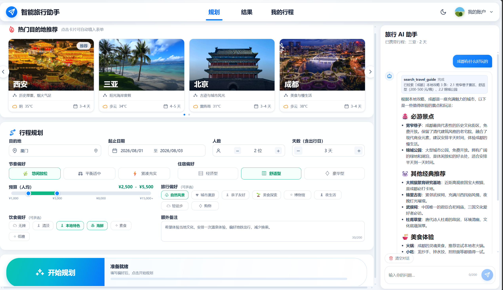
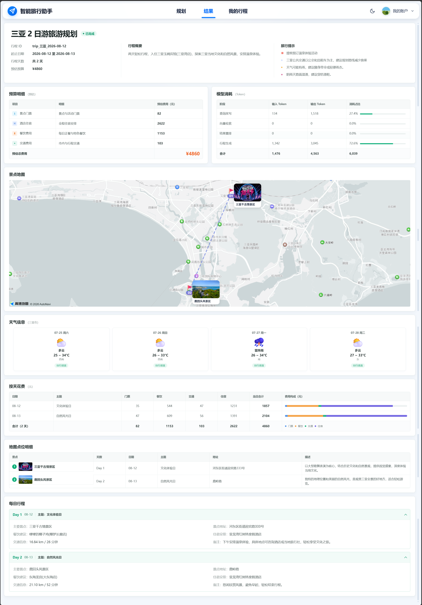
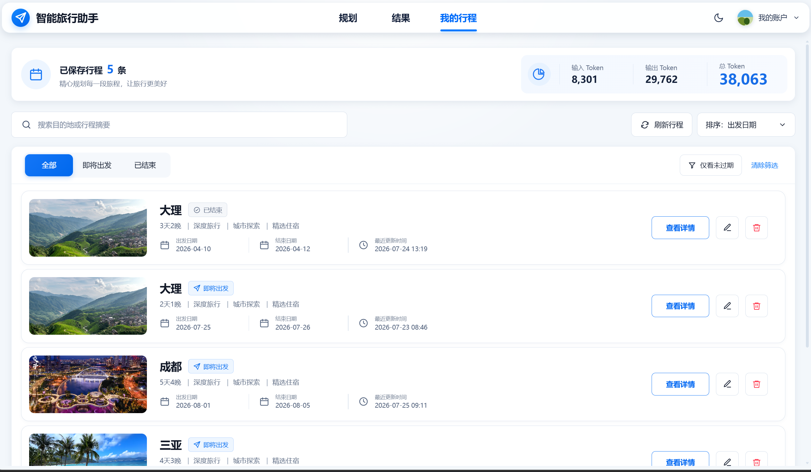
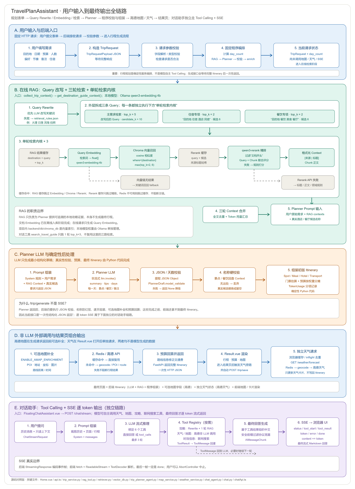
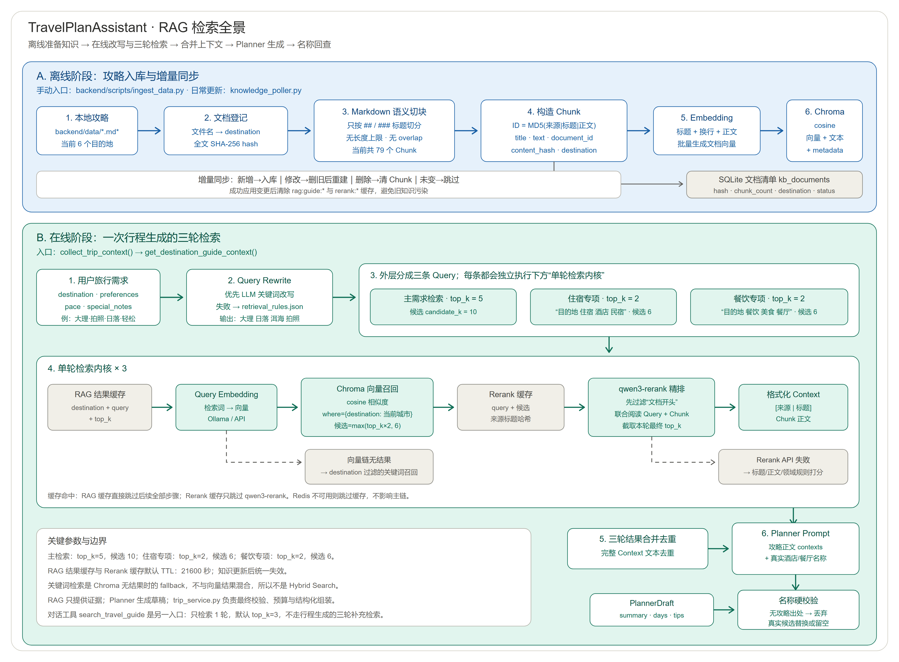
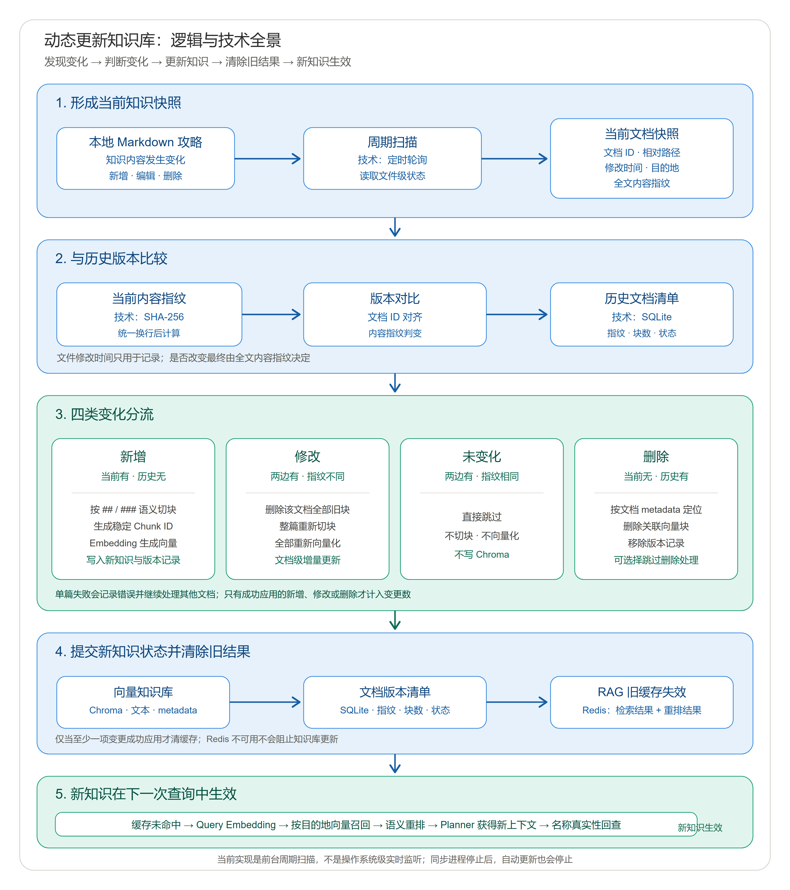

# 🗺️ 旅游推荐助手

> 融合大模型、RAG、本地攻略与高德地图能力的智能旅行规划系统

智旅云图是一个面向中文旅行场景的 AI 旅行规划项目。用户输入目的地、日期、预算、人数和偏好后，系统会自动生成结构化旅行方案，并进一步补充地图点位、天气信息、预算拆分、景点图片；同时提供热门目的地推荐与可调用工具的 AI 对话助手。

相比只输出一段文本的 LLM Demo，这个项目更强调完整链路落地：从 **行程生成、攻略检索、地图信息补全、天气补充、对话助手，到历史管理**，尽量把 AI 能力组织成一个可交互、可保存、可展示的产品原型。

## 📝 最近更新

更多更新见：[CHANGELOG.md](./CHANGELOG.md)

> **数据边界**：当前本地 Markdown 攻略用于 RAG 参考，并不等同于已逐条核验的实时 POI、门票、餐饮或住宿数据。涉及价格、营业状态和可预订性时，应以外部服务或人工核验结果为准。

---

## 📸 效果展示







## ✨ 项目亮点

- 🧠 **LLM 行程生成**：基于 LangChain 与 OpenAI-compatible 接口生成结构化旅行计划；Chat 与 Embedding 的模型名、Base URL、API Key 均可独立配置，Rerank 可配置模型名
- 📚 **本地攻略 RAG**：覆盖北京、大理、成都、西安、厦门、三亚 6 城；Query Rewrite + 向量召回 + Cross-encoder Rerank，并在 Chroma 侧用 destination metadata 过滤，避免跨城市内容混入
- 🛡️ **名称回查校验**：模型产出的景点与餐饮名必须能在本次检索到的攻略里找到出处，找不到就丢弃并退回真实候选或留空——「只用真实名称」是代码校验，不只是 prompt 约束
- 🧯 **不伪造的失败降级**：检索为空或模型不可用时返回空安排和原因说明，不用模板化景点/餐饮/住宿填充
- 💬 **AI 对话助手**：SSE 逐 token 流式输出，携带当前页面与行程只读上下文；模型原生 tool calling 按需调用天气、地图、攻略与联网搜索
- 🧰 **统一工具层 + MCP**：天气、地理编码、POI、路线、本地攻略检索、联网搜索共用同一批底层实现；既服务 Chat，也可通过 FastMCP 对外暴露
- 🔥 **热门目的地推荐**：首页轮播展示 6 城封面与近几日天气，按出行适宜度排序；点击卡片自动填入规划表单
- 🗺️ **高德地图补全与可视化**：补充地址、经纬度、POI、路线距离/耗时与图片，前端虚线箭头路线 + 打卡标记（后端默认关闭，需设 `ENABLE_AMAP_ENRICHMENT=true`）
- 🌦️ **天气感知**：结果页展示预报，并根据雨天/阴天修正旅行提示；推荐流用固定 adcode 有界并发拉天气
- 🔄 **知识库更新同步**：以内容哈希检测本地攻略变更，增量入库 / 替换 / 删除并清理相关 chunk 缓存（通过 `scripts/sync_knowledge_base.py` 触发，非后台常驻任务）
- ⚡ **Redis 缓存层**：覆盖天气、地图、RAG 检索与 Rerank 结果，Redis 不可用时自动降级
- 📊 **Token 消耗统计**：按 Query Rewrite、Query Embedding、Rerank、Planner 分项统计，接口响应与后端日志同步输出
- 💰 **预算拆分与智能编辑**：费用按交通/住宿/餐饮/门票等拆分；支持自然语言调整某一天行程后自动刷新地图信息
- 🗂️ **历史管理与前端闭环**：保存 / 查看 / 打开 / 删除历史行程；规划页、结果页、历史页覆盖核心业务路径

---

## 🏗️ 技术架构

### 技术栈

- 后端：FastAPI + Pydantic + SQLAlchemy
- LLM / Agent：LangChain（OpenAI-compatible Chat / Embedding / Rerank）
- 向量库：ChromaDB
- 缓存：Redis
- 工具层：统一 Tool Registry + FastMCP
- 外部服务：HTTPX + 高德地图 Web 服务 + 高德 JavaScript API
- 前端：Vue 3 + Vite + Ant Design Vue + TypeScript
- 数据库：SQLite

### 核心架构分层

| 层级        | 关键文件                                                | 职责                                                                  |
| :---------- | :------------------------------------------------------ | :-------------------------------------------------------------------- |
| 前端        | `frontend/src/views/`、`components/`、`services/` | 规划页、结果页、历史页；地图 / 对话 / 推荐组件与 API 封装             |
| 接口层      | `backend/app/api/routes/`                             | trip、weather、chat、recommendations 路由；SSE 帧编码                 |
| 服务层      | `backend/app/services/`                               | 行程编排、对话入参校验、推荐、地图 enrich、天气、缓存、存储、名称校验 |
| Agent 层    | `backend/app/agents/`                                 | 行程生成 Agent、对话 Agent（tool calling 循环）、Query Rewrite        |
| Tools / MCP | `backend/app/tools/`、`backend/app/mcp/`            | 天气 / 地图 / 攻略 / 联网搜索工具注册与执行；FastMCP 对外暴露         |
| RAG 层      | `backend/app/rag/`                                    | 向量入库、检索、Rerank、知识库同步与校验                              |
| 数据层      | `backend/data/`、SQLite、Redis、ChromaDB              | 本地攻略文档、行程持久化、缓存、向量索引                              |

### 系统数据流



系统数据流由两条相互独立的链路组成：主链路接收用户的目的地、日期、预算与偏好，依次完成 Query Rewrite、三路 RAG 检索、Planner LLM 草稿生成、名称真实性校验、行程与预算组装，并按需调用高德地图补全地址、坐标与路线；结果页加载后再独立获取天气。对话助手则根据用户问题自主调用攻略、天气、地图或联网搜索工具，并通过 SSE 将最终回答逐段返回到浏览器

### 数据存储与缓存分工

项目中将长期业务数据和短期高频查询结果分开处理：

- **SQLite：负责持久化存储**

  - 实现位置：`backend/app/config.py`、`backend/app/models/db_models.py`、`backend/app/services/storage_service.py`
  - 使用场景：保存用户生成后的完整旅行方案，并支持历史列表、详情查询与删除。
  - 存储方式：通过 SQLAlchemy 定义 `TripRecord` 表，核心字段包括 `trip_id`、`destination`、`summary`、`itinerary_json`、`created_at`、`updated_at`。
  - 设计原因：旅行方案属于用户主动保存的业务数据，需要长期保留、可查询、可删除；当前阶段采用 SQLite 轻量部署，适合个人项目和 Demo 场景。
- **Redis：负责缓存加速**

  - 实现位置：`backend/app/services/cache_service.py`，并被 `weather_service.py`、`map_service.py`、`retriever.py` 复用。
  - 使用场景：缓存天气查询、高德地图地理编码/POI/路线结果、RAG 检索结果和 OpenRouter Rerank 重排序结果。
  - 存储方式：业务模块生成缓存 key，`cache_service.py` 统一加上 `trip_planner` 前缀，将 Python `dict/list` 序列化为 JSON 字符串写入 Redis，并设置 TTL 自动过期。
  - 设计原因：天气、地图和 RAG/Rerank 结果存在明显重复查询，且在一段时间内相对稳定；使用 Redis 可以减少外部 API 调用和重复检索开销，提升接口响应速度与稳定性。

简言之：**SQLite 存“用户要留下来的行程数据”，Redis 存“短时间内可复用的中间查询结果”。**

### RAG 检索流程



  **离线阶段**（`scripts/ingest_data.py`，手动执行）

```text
本地 Markdown 攻略 → 按 ## / ### 标题切块 → Embedding 转向量 → 写入 ChromaDB
```

切块只认二级和三级标题，不设长度上限、不做重叠；每个文件首个标题之前的内容单独成块，标题记为"文档开头"。当前 6 个攻略共切出 79 块。写入 Chroma 的 metadata 有 5 个字段：`title`、`source`、`document_id`、`content_hash`、`destination`。Embedding 模型由 `EMBEDDING_MODEL` 决定，也可切到本地 Ollama。

这一步只在攻略内容变化时执行；日常增量同步见下方「知识库同步」。

**在线阶段**（每次请求）

```text
用户输入（目的地 / 偏好 / 节奏 / 备注）
    ↓
① Query Rewrite（LLM-based / 规则 fallback）
    输出：检索关键词，如"大理 美食 拍照 古城 洱海"
    规则 fallback 读 data/retrieval_rules.json，由 special_notes 触发
    ↓
② 读 RAG 结果缓存（Redis）
    key = rag:guide:{Rerank模型哈希}:{目的地}:{归一化 query}:{top_k}
    命中则直接返回，③～⑥ 全部跳过
    ↓
③ Query Embedding
    把检索关键词转向量，才能和 ChromaDB 里的文档向量做相似度计算
    ↓
④ 向量召回（ChromaDB）
    where={"destination": ...} 在召回阶段就隔离城市
    candidate_k = max(top_k×2, 6)
    Chroma 不可用或向量化失败时，降级为全文关键词计分召回
    ↓
⑤ 读 Rerank 缓存（Redis）
    key = rerank:{Rerank模型哈希}:{归一化 query}:{候选来源哈希}
    命中则直接按缓存分数重排，⑥ 跳过
    ↓
⑥ Cross-encoder Rerank（OpenRouter / 规则 fallback）
    调用 `nvidia/llama-nemotron-rerank-vl-1b-v2:free` 精排
    调用前先剔除"文档开头"这类低信息量片段，避免浪费 API 调用
    失败时降级为规则打分（标题命中 +3、正文命中 +1、文档开头 −8、跨城市 −5）
    ↓
⑦ 写两级缓存，返回 top-k 文本
    ↓
⑧ 名称回查校验
    模型返回行程后，逐个核对景点与餐饮名是否出自本次检索到的攻略；
    对不上的丢弃，退回真实候选或留空并写明原因
```

需要注意的两点：

- **缓存是先读后写，读点在链路前段而不是末尾。** 命中缓存时 token 统计会归零，因此统计值反映的是本次实际消耗，低于该 query 的历史累计消耗。
- **一次行程生成会跑 3 轮检索**：改写后的主查询（`top_k=5`），外加硬编码的住宿查询和餐饮查询（各 `top_k=2`）。对话侧的 `search_travel_guide` 工具只跑 1 轮，`top_k=3`。

### 动态知识库更新



知识库采用**周期扫描 + 文档级增量同步**，而不是操作系统级实时文件监听。每轮同步会扫描本地 Markdown 攻略，读取文档 ID、路径、目的地和修改时间，并在统一换行符后计算全文 SHA-256 内容指纹；再按文档 ID 与 SQLite 中保存的历史清单比较，识别以下四类变化：

- **新增**：按 `##` / `###` 标题语义切块，生成稳定 Chunk ID 和 metadata，调用 Embedding 后写入 Chroma，并登记文档指纹与 Chunk 数。
- **修改**：先删除该文档在 Chroma 中的全部旧 Chunk，再对当前全文重新切块、重新向量化并更新 SQLite；这是文档级增量更新，不是 Chunk 级差异更新。
- **未变化**：内容指纹相同则直接跳过，不切块、不调用 Embedding，也不写 Chroma。
- **删除**：按 `document_id`（并兼容旧 `source` metadata）删除关联向量块，再移除 SQLite 文档记录；同步时也可以选择只报告删除而暂不应用。

每篇文档独立处理，单篇失败只记录错误，不会阻止其他文档继续同步。只要至少一项新增、修改或删除成功应用，就会让 Redis 中的 RAG 检索结果缓存和 Rerank 缓存失效；Redis 不可用不会阻止 Chroma 与 SQLite 更新。下一次查询缓存未命中后，会重新执行 Query Embedding、按目的地向量召回和语义重排，因此 Planner 能获得最新攻略上下文，后续名称回查也会基于新知识进行。

> 当前周期同步运行在前台进程中；进程或终端停止后，自动更新也会停止。文件修改时间只用于记录，是否变化以全文内容指纹为准。

---

## 📁 项目结构

```text
AI Agent Travel Assistant/
├── backend/
│   ├── app/
│   │   ├── config.py                    # 环境变量、数据库与全局配置
│   │   ├── agents/
│   │   │   ├── trip_planner_agent.py    # LLM 行程生成
│   │   │   ├── chat_agent.py            # 对话 Agent：tool calling 循环与SSE流式输出
│   │   │   └── tools/
│   │   │       └── rag_tool.py           # 查询改写与检索规则加载
│   │   ├── api/
│   │   │   ├── main.py                   # FastAPI 应用入口
│   │   │   └── routes/
│   │   │       ├── trip.py               # 行程生成、编辑与历史接口
│   │   │       ├── chat.py               # 流式对话接口
│   │   │       ├── recommendations.py    # 热门目的地推荐接口
│   │   │       └── weather.py            # 天气预报接口
│   │   ├── models/
│   │   │   ├── schemas.py                # 行程相关 Pydantic 模型
│   │   │   ├── chat_schemas.py           # 对话请求 / 上下文 / 流式事件模型
│   │   │   └── db_models.py              # SQLAlchemy 数据表定义
│   │   ├── rag/
│   │   │   ├── guide_catalog.py          # 攻略文件与目的地映射
│   │   │   ├── vector_db.py              # 文档切片、Chroma 入库与检索
│   │   │   ├── retriever.py              # 检索、重排序与缓存
│   │   │   ├── document_registry.py      # 知识库文档清单与内容哈希
│   │   │   ├── knowledge_poller.py       # 本地攻略变更检测与增量同步
│   │   │   └── knowledge_validation.py   # 攻略、规则与评估配置一致性校验
│   │   ├── tools/  
│   │   │   ├── base.py                   # ToolResult 统一返回结构
│   │   │   ├── registry.py               # 工具注册表、规格与执行入口
│   │   │   ├── knowledge_tools.py        # 本地攻略检索工具
│   │   │   ├── map_tools.py              # 地理编码 / POI / 路线工具
│   │   │   ├── weather_tools.py          # 天气预报工具
│   │   │   └── web_search_tools.py       # 联网搜索工具
│   │   ├── mcp/
│   │   │   └── server.py                 # FastMCP Server，对外暴露旅行工具
│   │   └── services/
│   │       ├── trip_service.py           # 行程主编排、预算与地图补全
│   │       ├── chat_service.py           # 对话服务编排
│   │       ├── recommendation_service.py # 热门目的地推荐与天气排序
│   │       ├── fallback_candidates.py    # 从攻略上下文提取真实候选
│   │       ├── name_guard.py             # 校验模型输出的名称是否出自攻略上下文
│   │       ├── map_service.py            # 高德 POI、路线与图片
│   │       ├── weather_service.py        # 天气服务
│   │       ├── storage_service.py        # SQLite 行程存储
│   │       └── cache_service.py          # Redis 缓存与降级
│   ├── data/
│   │   ├── *_guide.md                    # 6 个目的地的本地攻略
│   │   └── retrieval_rules.json          # 查询扩展词配置
│   ├── eval/rag_eval_cases.json          # RAG 评估样例集
│   ├── scripts/                          # 入库、同步、调试、评估与校验脚本
│   ├── tests/                            # pytest 测试
│   ├── .env.example                      # 后端环境变量模板
│   └── requirements.txt
├── frontend/
│   ├── public/covers/                    # 热门目的地封面图
│   ├── src/
│   │   ├── views/
│   │   │   ├── Home.vue                   # 规划页：表单 + 热门目的地
│   │   │   ├── Result.vue                 # 结果页：行程 / 地图 / 天气 / 预算
│   │   │   └── History.vue                # 我的行程页
│   │   ├── components/
│   │   │   ├── AmapTripMap.vue            # 高德地图路线与打卡标记
│   │   │   ├── DestinationCarousel.vue   # 热门目的地轮播卡片
│   │   │   ├── FloatingChatAssistant.vue # AI对话助手
│   │   │   └── AppIcon.vue               # 统一图标组件
│   │   ├── services/
│   │   │   ├── api.ts                     # 行程 / 天气 / 推荐接口封装
│   │   │   └── chatApi.ts                 # 流式对话接口封装
│   │   ├── types/
│   │   │   ├── index.ts                   # 行程与推荐相关类型
│   │   │   └── chat.ts                    # 对话消息与上下文类型
│   │   ├── utils/
│   │   │   ├── chatContext.ts             # 页面 / 行程上下文组装
│   │   │   ├── clientCache.ts             # 前端本地缓存
│   │   │   └── markdown.ts                # 对话 Markdown 渲染
│   │   ├── App.vue                        # 页面切换与全局布局
│   │   └── main.ts                        # 前端入口
│   ├── .env.example                      # 前端环境变量模板
│   └── package.json
├── assets/                               # 展示素材与目的地封面源文件
├── docs/                                 # 架构、数据与优化文档（默认 gitignore）
├── README.md
└── CHANGELOG.md
```

> `docs/` 是本地开发与面试准备文档目录，默认已被 `.gitignore` 忽略，不随 GitHub 上传。

---

## 🚀 启动项目

以下命令默认从项目根目录开始执行。需要本机已安装 Python 3.11、Node.js 与 npm。后端和前端请分别在两个终端中启动。

### 1. 配置并启动后端

```powershell
cd backend
Copy-Item .env.example .env
# 编辑 .env，填写 LLM、Embedding 和高德地图等配置
pip install -r requirements.txt
uvicorn app.api.main:app --host 0.0.0.0 --port 8000
```

后端启动后可访问：

```text
API:      http://127.0.0.1:8000
API 文档: http://127.0.0.1:8000/docs
模型目录: http://127.0.0.1:8000/models
```

首次使用 RAG 时，另开终端执行以下命令将本地攻略写入 Chroma：

```powershell
cd backend
python scripts/ingest_data.py
```

### 2. 配置并启动前端

```powershell
cd frontend
Copy-Item .env.example .env
# 本机运行时，将 VITE_API_BASE_URL 配置为 http://127.0.0.1:8000
# 填写 VITE_AMAP_JS_KEY（高德 JS API Key）
npm install
npm run dev
```

前端地址：`http://127.0.0.1:5173`。

### 3. 可选：开启本地 Redis 缓存

默认 `REDIS_ENABLED=false`，即使未安装 Redis 也可以运行项目。若本机已安装 Redis，可运行 `redis-server`，再将 `backend/.env` 中的 `REDIS_ENABLED` 改为 `true`，以启用天气、地图和检索缓存。

---

## 🔄 关键业务链路

项目里同时存在两种编排范式，选择依据是任务的确定性。

### 显式编排：行程生成

行程生成的步骤是固定的，每一步都必须执行且顺序不能变，因此由 `trip_service.py` 按固定顺序调用，不交给模型决策：

```text
POST /trip/generate
  → 查询改写（LLM / 规则）
  → 3 轮攻略检索（主查询 + 住宿 + 餐饮）
  → Planner LLM 产出结构化草稿
  → 名称回查校验，丢弃无法归因的名称
  → 逐天组装 + 门票估算 + 预算按权重分摊
  → 可选的高德地图补全，并据实际路线回算交通费
  → 返回 Itinerary（不落库）
```

保存是用户的显式动作，走单独的 `POST /trip/save`；因此 `POST /trip/edit` 需要前端把当前完整行程回传。

### 自主决策：对话助手

对话无法预知用户会问什么，只能由模型决定调用哪些工具：

```text
POST /chat/stream
  → 裁剪历史（最多 20 条，单条 4000 字符）
  → 拼装 system prompt + 当前页面与行程只读上下文
  → 最多 3 轮 tool calling，每轮串行执行工具并把结果回灌
  → 逐 token 流式输出最终回答
```

轮次用尽后会换一个未绑定工具的模型实例再请求一次，并追加「只基于已有工具结果作答」的指令，确保用户一定拿得到回答。

SSE 事件共 6 种：`status`（thinking / tool / streaming）、`tool_start`、`tool_result`、`token`、`error`、`done`。流的最后一帧一定是 `done`。

### 逐 token 流式的实现要点

模型偶尔会把 `<tool_call>`、`<function=...>` 这类标记泄漏成正文。逐字下发时这类标记可能正好被切在两个 chunk 之间，因此下发前会计算「安全前缀」：把有可能正在形成标记的尾部留在缓冲区，等下一个 chunk 到达再判断。一旦确认泄漏就停止下发并切到工具摘要兜底；已经下发的干净前缀无法撤回，兜底内容追加在其后而不是整段替换。

---

## ⚠️ 已知边界

这些是当前实现的真实边界，不是待办清单：

- 默认 `REDIS_ENABLED=false`、`ENABLE_AMAP_ENRICHMENT=false`，两者都是加速项/增强项而非主链路依赖。
- 本地 RAG 不是开箱可用，首次必须执行 `scripts/ingest_data.py` 完成入库。
- 知识库同步没有后台常驻任务，只有前台 CLI 脚本的循环。
- 住宿不由模型产出：`PlannerDraft` 没有 hotel 字段，酒店取自攻略候选的第一个，且全程所有天共用同一家。
- 行程编辑不走 RAG，`TripEditRequest.trip_id` 未被使用，编辑结果不落库。
- `trip_id` 由「目的地 + 出发日期」拼成，同目的地同出发日再次保存会覆盖前一份。
- MCP server 与 `tools/registry.py` 共用底层实现，但工具描述与参数默认值是各自维护的，存在分叉风险。
- Rerank 通过 OpenRouter 独立配置 `RERANK_API_URL`、`RERANK_MODEL`、`RERANK_API_KEY`；Key 不会回退复用 `LLM_API_KEY`。
- `.env.example` 与 `config.py` 的默认值不完全一致（`LLM_MODEL`、`EMBEDDING_MODEL`、`REDIS_ENABLED`、`LLM_BASE_URL`），没有 `.env` 时行为会不同。
- 本地 Markdown 攻略用于 RAG 参考，不等同于已逐条核验的实时 POI、门票、餐饮或住宿数据。

---

## ✅ 运行测试

```powershell
cd backend
pytest
```

测试全部使用伪造的模型与外部服务，不联网、不消耗 API 额度。
